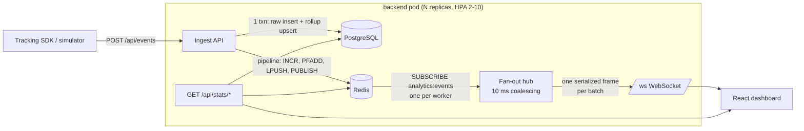

# Real-Time Analytics Dashboard

Live product-analytics dashboard for a web app: frontend tracking events
(`page_view`, `click`, `add_to_cart`, `purchase`, `signup`, `error`) are ingested over HTTP,
persisted to PostgreSQL, fanned out through Redis pub/sub, and pushed to every open dashboard
over WebSocket in well under 100 ms.

**Stack:** Python · Flask · gevent/gunicorn · flask-sock (WebSocket) · Redis (pub/sub, HyperLogLog,
counters) · PostgreSQL · React + Vite + Recharts · Docker · Kubernetes (HPA, PDB, Ingress)



## How it works

| Concern | Design |
|---|---|
| **Ingest** | `POST /api/events` accepts one event or `{events:[...]}` (≤1000). Validated, then raw rows (`execute_values`) and the per-minute rollup upsert (`ON CONFLICT DO UPDATE`, sorted keys → no deadlocks) are written in **one transaction**. |
| **Live counters** | One Redis pipeline per batch: `INCRBY` per-minute and daily counters, `PFADD` per-minute HyperLogLog for unique users (5-min active = `PFCOUNT` over 5 keys, ~0.8% error, 12 KB per key), `LPUSH/LTRIM` recent feed, `PUBLISH` the batch. |
| **Fan-out** | Each gunicorn worker holds **one** Redis subscription (not one per client). A flusher coalesces messages for 10 ms, serializes **once**, and drops the frame into each client's bounded queue; slow consumers drop frames instead of back-pressuring everyone. Any pod can ingest, every pod's viewers see it → the WebSocket tier scales horizontally behind a plain load balancer, no sticky sessions. |
| **WebSocket** | gevent worker → one greenlet per socket (thousands per worker). Server pings every 20 s; client reconnects with jittered exponential back-off and re-seeds from REST. |
| **Storage** | `events` (append-only) with `BRIN(occurred_at)`, `B-tree(event_type, occurred_at DESC)`, `B-tree(user_id, occurred_at DESC)`; `event_rollup_minute` (PK `bucket, event_type`). Dashboard reads hit the rollup, never scan raw rows. |
| **Frontend** | Frames are buffered in refs and committed to React state every 250 ms, so a burst of thousands of events costs 4 renders/s. Colors are fixed per event type (validated categorical palette, light + dark). |
| **Ops** | `/healthz` (liveness), `/readyz` (DB + Redis), `/metrics` (Prometheus: ingest latency histogram, ws clients gauge, frames sent). |
| **K8s** | Backend Deployment with readiness/liveness probes, `maxUnavailable: 0` rolling updates, `preStop` drain, topology spread, PDB `minAvailable: 1`, HPA on CPU 65% / memory 75% (2→10 pods, fast scale-up, slow scale-down to avoid dropping sockets). Postgres StatefulSet + PVC, Redis Deployment, ingress-nginx with 1 h socket timeouts. |

## Measured results

Measured on a **2 vCPU** cloud sandbox with Postgres, Redis, the backend (gunicorn, 4 gevent
workers) **and** the load generator all on the same box — i.e. a pessimistic setup.

| Resume claim | How to reproduce | Result |
|---|---|---|
| 100K+ daily events | `python scripts/simulate.py --rate 5000 --batch 100 --total 100000` | **100,000 events ingested in 30.7 s (≈3.3K events/s)**. 100K/day is ~1.2 events/s on average, so this is ~2,800× headroom. |
| Sub-100 ms latency | `python scripts/bench_ws.py --clients 1 --events 300` | HTTP POST → Postgres commit → Redis PUBLISH → pod → WebSocket frame: **p50 14 ms, p95 16 ms, p99 18 ms** |
| 1K+ concurrent users | `python scripts/bench_ws.py --clients 1000 --events 100` | **1000/1000 sockets connected in 1.2 s, 100,000/100,000 deliveries (0 drops), p50 56 ms, p95 87 ms, p99 103 ms** |
| 5M+ records, query time −50% | `python scripts/bench_query.py --seed 5000000` | 5,000,502 rows. Avg of 3 dashboard queries: **256 ms (no index) → 47 ms (indexes, −82%) → 6.5 ms (indexed rollup, −97%)** |
| 99.8% uptime on K8s | `python scripts/uptime_probe.py --url http://analytics.local --minutes 60` while running `kubectl rollout restart` / deleting pods / load-driving the HPA | Not measured here (no cluster in the sandbox). Manifests pass `kubeconform -strict` (15/15 resources valid). Run the probe on minikube/kind/EKS to get your own number. |

Query benchmark detail (5,000,502 events, 258,856 rollup rows, mean of 5 warm runs):

| Query | A: raw, no secondary index | B: raw + BRIN + composite B-tree | C: per-minute rollup |
|---|---|---|---|
| per-minute series, 24 h | 300.2 ms | 103.3 ms | 14.4 ms |
| breakdown by type, 24 h | 238.9 ms | 35.9 ms | 3.9 ms |
| `purchase` drill-down, 6 h | 228.9 ms | 2.4 ms | 1.2 ms |

## Run it

### Local (no Docker)
```bash
# Postgres on :5432 (db "analytics") and Redis on :6379 must be running
cd backend && pip install -r requirements.txt
gunicorn -c gunicorn.conf.py wsgi:app                 # :5000, schema auto-applied
cd ../frontend && npm install && npm run dev          # :5173, proxies /api and /ws
python scripts/simulate.py --rate 15 --batch 3        # traffic
```

### Docker Compose
```bash
docker compose up --build                             # http://localhost:8080
docker compose --profile demo up simulator            # optional traffic
docker compose up --scale backend=3                   # watch cross-pod fan-out
```

### Kubernetes (minikube / kind / EKS)
```bash
docker build -t ghcr.io/<you>/rta-backend:latest backend
docker build -t ghcr.io/<you>/rta-frontend:latest frontend   # push both, then edit image: in k8s/
kubectl apply -f k8s/
kubectl -n analytics get hpa -w                       # needs metrics-server
# add "127.0.0.1 analytics.local" to /etc/hosts (minikube: `minikube tunnel`)
```
Note: inside Kubernetes the frontend nginx's `upstream api { server backend:5000; }` resolves
to the backend Service; the Ingress also routes `/api` and `/ws` to the backend directly.

## API

| Method | Path | Notes |
|---|---|---|
| POST | `/api/events` | `{type, user_id, value?, props?, ts?}` or `{events:[...]}` → `202 {accepted}` |
| GET | `/api/stats/summary` | live KPIs from Redis |
| GET | `/api/stats/timeseries?minutes=60` | per-minute counts by type (rollup) |
| GET | `/api/stats/breakdown?minutes=60` | totals by type (rollup) |
| GET | `/api/events/recent?limit=50` | latest events |
| WS | `/ws` | frames: `hello`, `events` (batched), `stats` (1 Hz), `ping` |

## Interview notes — trade-offs worth explaining

- **Why Redis pub/sub and not Kafka?** Pub/sub is fire-and-forget: a pod that's down misses
  messages. That's acceptable here because the source of truth is Postgres and clients re-seed
  from REST on reconnect. If replay/consumer groups mattered, swap to Redis Streams or Kafka.
- **Why a rollup table and not just indexes?** Indexes made time-window scans ~5× faster; the
  rollup makes them ~40× faster because the dashboard reads ~1.4K pre-aggregated rows per day
  instead of every raw event. Cost: one extra upsert per (minute, type) per batch.
- **Why coalesce for 10 ms?** At 1K clients, one JSON encode + 1K socket writes per *batch*
  instead of per *event*. It trades ≤10 ms of latency for an order of magnitude fewer writes.
- **Scaling the write path further:** partition `events` by day (`PARTITION BY RANGE`),
  move to `COPY`, or put a queue in front and batch-insert asynchronously.
- **HPA + WebSockets:** CPU-based HPA works, but scale-down kills sockets — hence the 5-minute
  stabilization window, PDB, and client back-off. A custom metric (`ws_clients` per pod via
  prometheus-adapter) is the better long-term scaling signal.

## Layout
```
backend/   Flask app (app/), gunicorn config, Dockerfile
frontend/  React dashboard, nginx.conf, Dockerfile
k8s/       namespace, config/secret, postgres, redis, backend (+HPA, PDB), frontend (+HPA), ingress
scripts/   simulate.py, bench_ws.py, bench_query.py, uptime_probe.py
```
